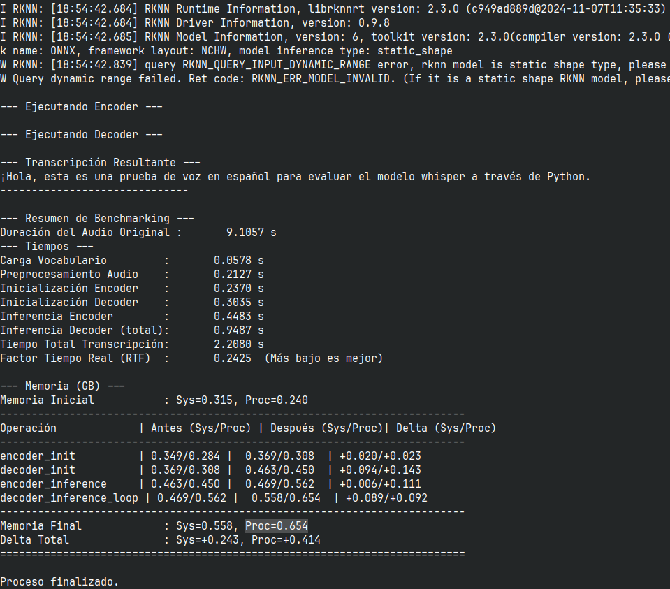

# Conversión del Modelo Whisper (Español) a RKNN para RK3588

Este repositorio contiene un Jupyter Notebook (`Descargar_Whisper.ipynb`) que detalla el proceso completo para descargar un modelo preentrenado OpenAI Whisper (específicamente `rjac/whisper-tiny-spanish` de Hugging Face), exportarlo al formato ONNX y finalmente convertirlo al formato RKNN para su ejecución acelerada en chips Rockchip RK3588.

Adicionalmente, incluye un script (`Inferencia_RKNN.py`) diseñado para ejecutar los modelos `.rknn` convertidos directamente en el dispositivo RK3588 usando `rknn-toolkit-lite2`.

## Descripción General

El **Jupyter Notebook** (`Descargar_Whisper.ipynb`) guía a través de los siguientes pasos principales (ejecutados en una máquina host x86_64):

1.  **Descarga y Preparación:**
    * Descarga del modelo Whisper (`rjac/whisper-tiny-spanish`) y su procesador desde Hugging Face.
    * Extracción y guardado de los filtros Mel específicos utilizados por Whisper.
    * Extracción y guardado del vocabulario completo (incluyendo tokens especiales y de timestamp).
    * Exportación del Encoder del modelo a formato ONNX.
    * Exportación del Decoder (incluyendo la capa de proyección final) a formato ONNX.
    * Simplificación y optimización de los modelos ONNX generados.
2.  **Conversión a RKNN:**
    * Uso de RKNN Toolkit v2.3.0 para convertir los archivos ONNX (encoder y decoder) al formato `.rknn`, optimizado para la NPU de Rockchip.
    * Se muestra la configuración para la plataforma `rk3588` y tipo de datos `fp` (punto flotante). Se menciona la posibilidad de cuantización (`i8`/`u8`) con un `dataset.txt` pero no ha sido evaluado este modo de cuantización.
3.  **Evaluación Local (ONNX):**
    * Código para cargar y ejecutar los modelos ONNX generados localmente usando `onnxruntime`.
    * Incluye el preprocesamiento de audio necesario (remuestreo, conversión a mono, cálculo del espectrograma Log-Mel) y la lógica de decodificación autoregresiva para obtener la transcripción de un archivo de audio de ejemplo (`test_es.wav`).

El **Script de Inferencia en Dispositivo** (`Inferencia_RKNN.py`):

* Está diseñado para ejecutarse directamente en el hardware RK3588 (ej. Radxa Rock 5C).
* Utiliza `rknn-toolkit-lite2` (v2.3.0) para cargar y ejecutar los modelos `.rknn`.
* Realiza el preprocesamiento de audio necesario (carga, remuestreo, espectrograma Mel).
* Ejecuta la inferencia del encoder y decoder en la NPU.
* Realiza la decodificación autoregresiva para generar el texto.
* Incluye corrección de Mojibake común en modelos BPE.

## Requisitos Previos

**Para la Conversión (Jupyter Notebook en Host x86_64):**

* **Hardware:** Máquina **x86_64**.
* **Software:**
    * **Python:** Probado con la versión **3.10.16**. Se recomienda usar un entorno virtual (conda, venv).
    * **RKNN Toolkit:** Versión **v2.3.0** (paquete completo para x86_64).
    * **Bibliotecas Python:** Ver la sección de instalación.

**Para la Inferencia (Script `Inferencia_RKNN.py` en Dispositivo RK3588):**

* **Hardware:** Dispositivo con chip **Rockchip RK3588** (Probado en Radxa Rock 5C).
* **Software:**
    * **Sistema Operativo:** Linux (Probado en Debian 12).
    * **Python:** Compatible con RKNN-Lite2 (e.g., 3.9, 3.10).
    * **RKNN Toolkit Lite 2:** Versión **2.3.0** instalada en el dispositivo. (Consulta la [documentación de Rockchip](https://github.com/airockchip/rknn-toolkit2/tree/master/rknn-toolkit-lite2) para la instalación en el dispositivo).
    * **Bibliotecas Python (en dispositivo):** `numpy`, `soundfile`, `scipy`, `torch` (para el cálculo del espectrograma), `rknnlite`.
        ```bash
        # Ejemplo de instalación en el dispositivo (ajusta según tu gestor de paquetes)
        sudo apt update
        sudo apt install python3-pip libsndfile1 # Dependencias básicas
        pip3 install numpy soundfile scipy torch rknn_toolkit_lite2-*-cp3*-manylinux_2_17_aarch64.whl
        # Asegúrate de descargar el wheel correcto de rknn-toolkit-lite2 para tu Python/Arch
        ```

## Instalación (Host x86_64 para Conversión)

1.  **Clona el repositorio:**
    ```bash
    git clone <URL_DEL_REPOSITORIO>
    cd <NOMBRE_DEL_REPOSITORIO>
    ```

2.  **(Recomendado) Crea y activa un entorno virtual:**
    ```bash
    # Usando conda
    conda create -n rknn_env python=3.10
    conda activate rknn_env

    # O usando venv
    python3 -m venv rknn_env
    source rknn_env/bin/activate
    ```

3.  **Instala RKNN Toolkit v2.3.0 y sus dependencias:**
    * Descarga el archivo de requisitos:
        [`requirements_cp310-2.3.0.txt`](https://github.com/airockchip/rknn-toolkit2/raw/v2.3.0/rknn-toolkit2/packages/x86_64/requirements_cp310-2.3.0.txt)
    * Descarga el paquete wheel de RKNN Toolkit:
        [`rknn_toolkit2-2.3.0-cp310-cp310-manylinux_2_17_x86_64.manylinux2014_x86_64.whl`](https://github.com/airockchip/rknn-toolkit2/raw/v2.3.0/rknn-toolkit2/packages/x86_64/rknn_toolkit2-2.3.0-cp310-cp310-manylinux_2_17_x86_64.manylinux2014_x86_64.whl)
    * Instala las dependencias y el paquete (asegúrate de tener los archivos descargados en tu directorio actual o proporciona la ruta correcta):
        ```bash
        pip install -r requirements_cp310-2.3.0.txt
        pip install rknn_toolkit2-2.3.0-cp310-cp310-manylinux_2_17_x86_64.manylinux2014_x86_64.whl
        ```
        *(Nota: La instalación de RKNN Toolkit puede tener dependencias adicionales del sistema. Consulta la [documentación oficial de RKNN Toolkit](https://github.com/airockchip/rknn-toolkit2) si encuentras problemas).*

4.  **Instala las bibliotecas adicionales para Whisper y ONNX:**
    ```bash
    pip install openai-whisper librosa onnx onnxsim onnxruntime soundfile scipy transformers torch numpy
    ```
    *(Asegúrate de que las versiones instaladas sean compatibles entre sí y con RKNN Toolkit v2.3.0. El notebook fue probado con Python 3.10.16).*

5.  **Instala Jupyter:**
    ```bash
    pip install notebook
    ```

## Uso

### 1. Conversión del Modelo (Host x86_64)

1.  **Inicia Jupyter Notebook:**
    ```bash
    jupyter notebook
    ```
2.  **Abre el notebook:** Navega y abre el archivo `Descargar_Whisper.ipynb` (o como lo hayas llamado).
3.  **Ejecuta las celdas:** Ejecuta las celdas del notebook en orden secuencial.
    * **Parte 1:** Realizará la descarga, preparación y exportación a ONNX. Los archivos `.onnx`, `vocab_es.txt` y `mel_80_filters.txt` se guardarán en el directorio `./model`.
    * **Parte 2:** Convertirá los archivos `.onnx` a `.rknn` usando la configuración especificada (por defecto, `rk3588`, `fp`). Los archivos `.rknn` también se guardarán en `./model`. *Esta parte requiere que RKNN Toolkit esté correctamente instalado en tu máquina x86_64.*
    * **Parte 3:** Ejecutará una inferencia usando los modelos **ONNX** localmente con `onnxruntime` sobre el archivo `test_es.wav`. Sirve como verificación funcional.

### 2. Ejecución en Dispositivo (RK3588 con RKNN-Lite)

1.  **Transfiere los archivos necesarios al dispositivo RK3588:**
    * El script: `Inferencia_RKNN.py`
    * Los modelos convertidos: `./model/whisper_encoder_*.rknn` y `./model/whisper_decoder_*.rknn`
    * Los archivos auxiliares: `./model/vocab_es.txt` y `./model/mel_80_filters.txt` (asegúrate que las rutas dentro del script `Inferencia_RKNN.py` apunten correctamente a estos archivos en el dispositivo, o colócalos en `./model` relativo al script).
    * Un archivo de audio para probar (e.g., `test_es.wav`).

2.  **Asegúrate de tener los requisitos instalados en el dispositivo** (Python, RKNN-Lite 2.3.0, numpy, soundfile, scipy, torch - ver sección "Requisitos Previos").

3.  **Ejecuta el script de inferencia desde la terminal del dispositivo:**
    ```bash
    python3 Inferencia_RKNN.py \
        --encoder_model_path ./model/whisper_encoder_rjac_whisper-tiny-spanish.rknn \
        --decoder_model_path ./model/whisper_decoder_rjac_whisper-tiny-spanish.rknn \
        --audio_path ./test_es.wav
    ```
    * Reemplaza las rutas si tus archivos están en ubicaciones diferentes.
    * El script cargará el audio, lo preprocesará, ejecutará los modelos RKNN en la NPU y mostrará la transcripción resultante en la consola.

* **Entorno de Prueba Exitoso:** La inferencia con `Inferencia_RKNN.py` ha sido probada en un **Radxa Rock 5C** con **Debian 12** y **RKNN Toolkit Lite 2.3.0**.



## Archivos Generados (por el Notebook)

Después de ejecutar el notebook de conversión, encontrarás los siguientes archivos en el directorio `./model`:

* `mel_80_filters.txt`: Pesos del banco de filtros Mel.
* `vocab_es.txt`: Vocabulario del modelo, incluyendo tokens especiales.
* `whisper_encoder_rjac_whisper-tiny-spanish.onnx`: Modelo ONNX del encoder Whisper.
* `whisper_decoder_rjac_whisper-tiny-spanish.onnx`: Modelo ONNX del decoder Whisper (con proyección).
* `whisper_encoder_rjac_whisper-tiny-spanish.rknn`: Modelo RKNN del encoder Whisper (para NPU).
* `whisper_decoder_rjac_whisper-tiny-spanish.rknn`: Modelo RKNN del decoder Whisper (para NPU).

## Notas Importantes

* **Versión RKNN Toolkit / Lite:** Este proyecto usa **RKNN Toolkit v2.3.0** (host) y **RKNN Toolkit Lite v2.3.0** (dispositivo). Puede que no funcione correctamente con otras versiones.
* **Shapes ONNX:** La conversión a RKNN es sensible a las formas (shapes) de los tensores en el modelo ONNX. Se sugiere usar [Netron](https://netron.app/) para inspeccionar los modelos `.onnx`.
* **Cuantización:** La conversión por defecto usa `dtype='fp'`. Si deseas habilitar la cuantización (`i8` o `u8`) en el notebook, deberás modificarlo y proporcionar un `dataset.txt` adecuado. El script `Inferencia_RKNN.py` puede necesitar ajustes (e.g., `astype(np.float16)` o `astype(np.int8)`) dependiendo del tipo de cuantización usado.
* **Ejecución en Dispositivo:** Usa el script `Inferencia_RKNN.py` para ejecutar los modelos `.rknn` directamente en tu dispositivo RK3588. El Jupyter Notebook es solo para la conversión y pruebas locales con ONNX.

## Licencia

Licencia MIT. Ver archivo LICENCE.

## Contribuciones

Las contribuciones son bienvenidas. Por favor, abre un issue o un pull request.

## Agradecimientos

* OpenAI por el modelo Whisper.
* Hugging Face por la fácil distribución de modelos.
* Rockchip por RKNN Toolkit y RKNN-Lite2.
* El autor del modelo `rjac/whisper-tiny-spanish`.